# STC types diagram (`src/types`)

This document visualizes the **interfaces** declared under `src/types/*.d.ts` and the main relationships between them:

- **Inheritance** (`extends`) is shown with solid triangle arrows.
- **Usage/association** (a field or parameter referencing another interface) is shown with dashed arrows and short labels.

Notes about the current state of `src/types`:

- `src/types/fs.d.ts` is currently empty (no interfaces declared).
- `src/types/storage.d.ts` currently duplicates the `STC.Docs` spec (same interfaces as `src/types/docs.d.ts`).
- Some relationships go through **type aliases** (not interfaces), so they are not represented as nodes here (e.g. `STC.Transport.AuthConfig`).

```mermaid
classDiagram
direction LR

class STC_Collection_Options["STC.Collection.Options"]
<<interface>> STC_Collection_Options
class STC_Collection_TreeOptions["STC.Collection.TreeOptions"]
<<interface>> STC_Collection_TreeOptions
class STC_Collection_UpsertResult["STC.Collection.UpsertResult"]
<<interface>> STC_Collection_UpsertResult
class STC_Collection_Collection["STC.Collection.Collection"]
<<interface>> STC_Collection_Collection
class STC_Collection_TreeCollection["STC.Collection.TreeCollection"]
<<interface>> STC_Collection_TreeCollection
class STC_Collection_Factory["STC.Collection.Factory"]
<<interface>> STC_Collection_Factory

STC_Collection_Options <|-- STC_Collection_TreeOptions
STC_Collection_Collection <|-- STC_Collection_TreeCollection
STC_Collection_Collection ..> STC_Collection_UpsertResult : upsert()
STC_Collection_Factory ..> STC_Collection_Options : create()
STC_Collection_Factory ..> STC_Collection_TreeOptions : createTree()
STC_Collection_Factory ..> STC_Collection_Collection : creates
STC_Collection_Factory ..> STC_Collection_TreeCollection : creates

class STC_Channel_DataEvent["STC.Channel.DataEvent"]
<<interface>> STC_Channel_DataEvent
class STC_Channel_SystemEvent["STC.Channel.SystemEvent"]
<<interface>> STC_Channel_SystemEvent
class STC_Channel_Params["STC.Channel.Params"]
<<interface>> STC_Channel_Params
class STC_Channel_CreateOptions["STC.Channel.CreateOptions"]
<<interface>> STC_Channel_CreateOptions
class STC_Channel_SubscribeOptions["STC.Channel.SubscribeOptions"]
<<interface>> STC_Channel_SubscribeOptions
class STC_Channel_Channel["STC.Channel.Channel"]
<<interface>> STC_Channel_Channel
class STC_Channel_Factory["STC.Channel.Factory"]
<<interface>> STC_Channel_Factory

class STC_Channel_Proposal_HistoryOptions["STC.Channel.Proposal.HistoryOptions"]
<<interface>> STC_Channel_Proposal_HistoryOptions
class STC_Channel_Proposal_Ordering["STC.Channel.Proposal.Ordering"]
<<interface>> STC_Channel_Proposal_Ordering
class STC_Channel_Proposal_ThroughputLimits["STC.Channel.Proposal.ThroughputLimits"]
<<interface>> STC_Channel_Proposal_ThroughputLimits

STC_Channel_Channel ..> STC_Channel_Params : getParams()
STC_Channel_Channel ..> STC_Channel_DataEvent : subscribe()
STC_Channel_Channel ..> STC_Channel_SystemEvent : subscribe()
STC_Channel_Factory ..> STC_Channel_CreateOptions : create()
STC_Channel_Factory ..> STC_Channel_Channel : creates

class STC_Diagnostics_ErrorInfo["STC.Diagnostics.ErrorInfo"]
<<interface>> STC_Diagnostics_ErrorInfo
class STC_Diagnostics_Event["STC.Diagnostics.Event"]
<<interface>> STC_Diagnostics_Event
class STC_Diagnostics_Sink["STC.Diagnostics.Sink"]
<<interface>> STC_Diagnostics_Sink
class STC_Diagnostics_CreateSinkOptions["STC.Diagnostics.CreateSinkOptions"]
<<interface>> STC_Diagnostics_CreateSinkOptions
class STC_Diagnostics_Factory["STC.Diagnostics.Factory"]
<<interface>> STC_Diagnostics_Factory
class STC_Diagnostics_Context["STC.Diagnostics.Context"]
<<interface>> STC_Diagnostics_Context

class STC_Diagnostics_Proposal_Limits["STC.Diagnostics.Proposal.Limits"]
<<interface>> STC_Diagnostics_Proposal_Limits
class STC_Diagnostics_Proposal_Transport["STC.Diagnostics.Proposal.Transport"]
<<interface>> STC_Diagnostics_Proposal_Transport

STC_Diagnostics_Event ..> STC_Diagnostics_ErrorInfo : error?
STC_Diagnostics_Sink --> STC_Channel_Channel : channel
STC_Diagnostics_Sink ..> STC_Collection_Collection : history?
STC_Diagnostics_Factory ..> STC_Diagnostics_Sink : createSink()
STC_Diagnostics_Factory ..> STC_Diagnostics_Context : createContext()
STC_Diagnostics_Context ..> STC_Diagnostics_Event : emit()

class STC_ApiClient_CallError["STC.ApiClient.CallError"]
<<interface>> STC_ApiClient_CallError
class STC_ApiClient_CallResult["STC.ApiClient.CallResult"]
<<interface>> STC_ApiClient_CallResult
class STC_ApiClient_CallRequest["STC.ApiClient.CallRequest"]
<<interface>> STC_ApiClient_CallRequest
class STC_ApiClient_CallOptions["STC.ApiClient.CallOptions"]
<<interface>> STC_ApiClient_CallOptions
class STC_ApiClient_Client["STC.ApiClient.Client"]
<<interface>> STC_ApiClient_Client
class STC_ApiClient_Proposal_CancelOptions["STC.ApiClient.Proposal.CancelOptions"]
<<interface>> STC_ApiClient_Proposal_CancelOptions
class STC_ApiClient_Proposal_MethodCapabilities["STC.ApiClient.Proposal.MethodCapabilities"]
<<interface>> STC_ApiClient_Proposal_MethodCapabilities

STC_ApiClient_CallResult ..> STC_ApiClient_CallError : error?
STC_ApiClient_CallRequest --> STC_Channel_Channel : channel
STC_ApiClient_Client ..> STC_ApiClient_CallOptions : call()
STC_ApiClient_Client ..> STC_ApiClient_CallRequest : returns

class STC_Transport_Endpoint["STC.Transport.Endpoint"]
<<interface>> STC_Transport_Endpoint
class STC_Transport_Options["STC.Transport.Options"]
<<interface>> STC_Transport_Options
class STC_Transport_Client["STC.Transport.Client"]
<<interface>> STC_Transport_Client
class STC_Transport_Factory["STC.Transport.Factory"]
<<interface>> STC_Transport_Factory
class STC_Transport_Proposal_RetryPolicy["STC.Transport.Proposal.RetryPolicy"]
<<interface>> STC_Transport_Proposal_RetryPolicy
class STC_Transport_Proposal_Options["STC.Transport.Proposal.Options"]
<<interface>> STC_Transport_Proposal_Options

STC_Transport_Options --> STC_Transport_Endpoint : endpoint
STC_Transport_Options ..> STC_Diagnostics_Sink : diagnostics?
STC_Transport_Client --> STC_Transport_Options : options
STC_Transport_Client ..> STC_ApiClient_CallRequest : call()
STC_Transport_Client ..> STC_ApiClient_CallResult : call()
STC_Transport_Client ..> STC_Channel_Channel : openChannel()
STC_Transport_Factory ..> STC_Transport_Client : createClient()
STC_Transport_Proposal_Options ..> STC_Transport_Proposal_RetryPolicy : retry?
STC_Transport_Proposal_Options ..> STC_Channel_Proposal_ThroughputLimits : channelLimits?

class STC_ApiHost_CallContext["STC.ApiHost.CallContext"]
<<interface>> STC_ApiHost_CallContext
class STC_ApiHost_MethodDescriptor["STC.ApiHost.MethodDescriptor"]
<<interface>> STC_ApiHost_MethodDescriptor
class STC_ApiHost_Options["STC.ApiHost.Options"]
<<interface>> STC_ApiHost_Options
class STC_ApiHost_Host["STC.ApiHost.Host"]
<<interface>> STC_ApiHost_Host
class STC_ApiHost_Factory["STC.ApiHost.Factory"]
<<interface>> STC_ApiHost_Factory

class STC_ApiHost_Proposal_Authorizer["STC.ApiHost.Proposal.Authorizer"]
<<interface>> STC_ApiHost_Proposal_Authorizer
class STC_ApiHost_Proposal_RateLimiter["STC.ApiHost.Proposal.RateLimiter"]
<<interface>> STC_ApiHost_Proposal_RateLimiter
class STC_ApiHost_Proposal_Recorder["STC.ApiHost.Proposal.Recorder"]
<<interface>> STC_ApiHost_Proposal_Recorder

STC_ApiHost_CallContext --> STC_Channel_Channel : channel
STC_ApiHost_CallContext --> STC_Runtime_Runtime : runtime
STC_ApiHost_CallContext --> STC_Diagnostics_Context : diagnostics
STC_ApiHost_Options --> STC_Runtime_Runtime : runtime
STC_ApiHost_Options ..> STC_Diagnostics_Sink : diagnostics?
STC_ApiHost_Options ..> STC_Transport_Client : transports[]
STC_ApiHost_MethodDescriptor ..> STC_ApiClient_Proposal_MethodCapabilities : capabilities?
STC_ApiHost_MethodDescriptor ..> STC_ApiHost_CallContext : handler(ctx)
STC_ApiHost_Host ..> STC_ApiHost_MethodDescriptor : register()
STC_ApiHost_Factory ..> STC_ApiHost_Host : create()

class STC_Runtime_Config["STC.Runtime.Config"]
<<interface>> STC_Runtime_Config
class STC_Runtime_Runtime["STC.Runtime.Runtime"]
<<interface>> STC_Runtime_Runtime
class STC_Runtime_Loader["STC.Runtime.Loader"]
<<interface>> STC_Runtime_Loader

STC_Runtime_Runtime --> STC_Runtime_Config : config
STC_Runtime_Runtime ..> STC_Channel_CreateOptions : createChannel?()
STC_Runtime_Runtime ..> STC_Diagnostics_CreateSinkOptions : createDiagnosticsSink?()
STC_Runtime_Loader ..> STC_Runtime_Config : load()

class STC_Workbench_CreateOptions["STC.Workbench.CreateOptions"]
<<interface>> STC_Workbench_CreateOptions
class STC_Workbench_Workbench["STC.Workbench.Workbench"]
<<interface>> STC_Workbench_Workbench
class STC_Workbench_ModuleExport["STC.Workbench.ModuleExport"]
<<interface>> STC_Workbench_ModuleExport
class STC_Workbench_ModuleContext["STC.Workbench.ModuleContext"]
<<interface>> STC_Workbench_ModuleContext
class STC_Workbench_App["STC.Workbench.App"]
<<interface>> STC_Workbench_App
class STC_Workbench_Factory["STC.Workbench.Factory"]
<<interface>> STC_Workbench_Factory
class STC_Workbench_Proposal_Plugin["STC.Workbench.Proposal.Plugin"]
<<interface>> STC_Workbench_Proposal_Plugin

STC_Workbench_CreateOptions ..> STC_Runtime_Config : config?
STC_Workbench_CreateOptions ..> STC_Transport_Client : transport.client?
STC_Workbench_CreateOptions ..> STC_Diagnostics_Sink : diagnostics.sink?
STC_Workbench_Workbench --> STC_Runtime_Runtime : runtime
STC_Workbench_Workbench ..> STC_Diagnostics_Sink : diagnostics?
STC_Workbench_Workbench ..> STC_Collection_Factory : collections?
STC_Workbench_Workbench ..> STC_Channel_Factory : channels?
STC_Workbench_Workbench ..> STC_Chat_Adapter : chatAdapter?
STC_Workbench_Workbench ..> STC_Workbench_App : createApp()
STC_Workbench_ModuleContext --> STC_Runtime_Runtime : runtime
STC_Workbench_ModuleContext ..> STC_Collection_Factory : collections?
STC_Workbench_ModuleContext ..> STC_Channel_Factory : channels?
STC_Workbench_ModuleContext ..> STC_Diagnostics_Context : diagnostics?
STC_Workbench_ModuleContext ..> STC_Chat_Chat : chats.open()
STC_Workbench_Factory ..> STC_Workbench_Workbench : create()

class STC_Policy_Record["STC.Policy.Record"]
<<interface>> STC_Policy_Record
class STC_Policy_Registry["STC.Policy.Registry"]
<<interface>> STC_Policy_Registry
class STC_Policy_Index["STC.Policy.Index"]
<<interface>> STC_Policy_Index
class STC_Policy_Loader["STC.Policy.Loader"]
<<interface>> STC_Policy_Loader
class STC_Policy_LoadOptions["STC.Policy.LoadOptions"]
<<interface>> STC_Policy_LoadOptions
class STC_Policy_LoadResult["STC.Policy.LoadResult"]
<<interface>> STC_Policy_LoadResult
class STC_Policy_Proposal_Profile["STC.Policy.Proposal.Profile"]
<<interface>> STC_Policy_Proposal_Profile
class STC_Policy_Proposal_Check["STC.Policy.Proposal.Check"]
<<interface>> STC_Policy_Proposal_Check

STC_Policy_Registry --> STC_Collection_Collection : collection
STC_Policy_Registry --> STC_Policy_Index : getIndex()
STC_Policy_Loader ..> STC_Policy_LoadOptions : load()
STC_Policy_Loader ..> STC_Policy_LoadResult : load()

class STC_Docs_GenerateOptions["STC.Docs.GenerateOptions"]
<<interface>> STC_Docs_GenerateOptions
class STC_Docs_GenerateResult["STC.Docs.GenerateResult"]
<<interface>> STC_Docs_GenerateResult
class STC_Docs_Generator["STC.Docs.Generator"]
<<interface>> STC_Docs_Generator
class STC_Docs_Factory["STC.Docs.Factory"]
<<interface>> STC_Docs_Factory
class STC_Docs_FactoryOptions["STC.Docs.FactoryOptions"]
<<interface>> STC_Docs_FactoryOptions
class STC_Docs_Proposal_LiveServer["STC.Docs.Proposal.LiveServer"]
<<interface>> STC_Docs_Proposal_LiveServer

STC_Docs_Generator ..> STC_Docs_GenerateOptions : generate()
STC_Docs_Generator ..> STC_Docs_GenerateResult : returns
STC_Docs_Factory ..> STC_Docs_FactoryOptions : create()
STC_Docs_Factory ..> STC_Docs_Generator : creates
STC_Docs_FactoryOptions ..> STC_Policy_Registry : policyRegistry?

class STC_Chat_Limits["STC.Chat.Limits"]
<<interface>> STC_Chat_Limits
class STC_Chat_Descriptor["STC.Chat.Descriptor"]
<<interface>> STC_Chat_Descriptor
class STC_Chat_Message["STC.Chat.Message"]
<<interface>> STC_Chat_Message
class STC_Chat_PageCursor["STC.Chat.PageCursor"]
<<interface>> STC_Chat_PageCursor
class STC_Chat_FetchMessagesOptions["STC.Chat.FetchMessagesOptions"]
<<interface>> STC_Chat_FetchMessagesOptions
class STC_Chat_FetchMessagesResult["STC.Chat.FetchMessagesResult"]
<<interface>> STC_Chat_FetchMessagesResult
class STC_Chat_MessageDraft["STC.Chat.MessageDraft"]
<<interface>> STC_Chat_MessageDraft
class STC_Chat_Chat["STC.Chat.Chat"]
<<interface>> STC_Chat_Chat
class STC_Chat_AppendInput["STC.Chat.AppendInput"]
<<interface>> STC_Chat_AppendInput
class STC_Chat_BeginMessageInput["STC.Chat.BeginMessageInput"]
<<interface>> STC_Chat_BeginMessageInput
class STC_Chat_UpdateMyMessagePatch["STC.Chat.UpdateMyMessagePatch"]
<<interface>> STC_Chat_UpdateMyMessagePatch
class STC_Chat_Adapter["STC.Chat.Adapter"]
<<interface>> STC_Chat_Adapter
class STC_Chat_AdapterRef["STC.Chat.AdapterRef"]
<<interface>> STC_Chat_AdapterRef
class STC_Chat_AdapterOptions["STC.Chat.AdapterOptions"]
<<interface>> STC_Chat_AdapterOptions
class STC_Chat_InMemoryChatAdapter["STC.Chat.InMemoryChatAdapter"]
<<interface>> STC_Chat_InMemoryChatAdapter
class STC_Chat_Proposal_StatefulChat["STC.Chat.Proposal.StatefulChat"]
<<interface>> STC_Chat_Proposal_StatefulChat

STC_Chat_Adapter <|-- STC_Chat_InMemoryChatAdapter
STC_Chat_Chat <|-- STC_Chat_Proposal_StatefulChat
STC_Chat_Chat --> STC_Channel_Channel : channel
STC_Chat_Chat ..> STC_Chat_Descriptor : getDescriptor()
STC_Chat_Chat ..> STC_Chat_FetchMessagesOptions : fetchMessages()
STC_Chat_Chat ..> STC_Chat_FetchMessagesResult : fetchMessages()
STC_Chat_Chat ..> STC_Chat_AppendInput : append()
STC_Chat_Chat ..> STC_Chat_BeginMessageInput : beginMessage()
STC_Chat_Chat ..> STC_Chat_UpdateMyMessagePatch : updateMyMessage()
STC_Chat_Chat ..> STC_Chat_MessageDraft : streaming
STC_Chat_FetchMessagesResult --> STC_Chat_Message : messages[]
STC_Chat_Adapter ..> STC_Chat_AdapterRef : open(ref)
STC_Chat_Adapter ..> STC_Chat_Chat : returns
STC_Chat_Proposal_StatefulChat --> STC_Collection_Collection : messages

class STC_GitHub_Chat_Adapter["STC.GitHub.Chat.Adapter"]
<<interface>> STC_GitHub_Chat_Adapter
class STC_GitHub_Chat_AdapterOptions["STC.GitHub.Chat.AdapterOptions"]
<<interface>> STC_GitHub_Chat_AdapterOptions

STC_Chat_Adapter <|-- STC_GitHub_Chat_Adapter
STC_Chat_AdapterOptions <|-- STC_GitHub_Chat_AdapterOptions
```

